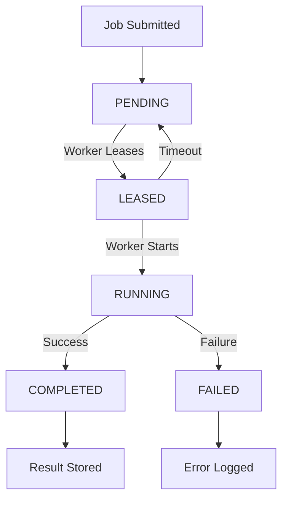

# PiGenus Architecture

## Overview
PiGenus is a **persistent orchestration node** designed to run on a **Raspberry Pi 5** as the core infrastructure component for the GENUS ecosystem. It provides reliable, low-power, and secure coordination for distributed tasks and long-term memory.

---

## Core Components

### 1. API Layer
- **Framework**: FastAPI (Python 3.12+)
- **Purpose**: RESTful HTTP interface for clients and workers
- **Endpoints**:
  - `/health`: System health checks
  - `/auth/token`: JWT token generation
  - `/workers/*`: Worker registration and heartbeat
  - `/jobs/*`: Job submission, leasing, and acknowledgment
  - `/memory/*`: Long-term memory storage
  - `/admin/*`: Administrative endpoints

### 2. Core Logic
- **Job Manager**: Manages job lifecycle (PENDING → LEASED → RUNNING → COMPLETED/FAILED)
- **Worker Manager**: Coordinates worker registration, heartbeat, and job assignment
- **Scheduler**: Runs nightly maintenance jobs (backup, cleanup, summarization)

### 3. Database
- **Primary**: SQLite (low overhead, file-based)
- **Models**: SQLModel (SQLAlchemy + Pydantic)
- **Entities**:
  - `User`: System users
  - `Worker`: Registered workers
  - `Job`: Task queue items
  - `Session`: User sessions
  - `Message`: Session messages
  - `MemoryItem`: Long-term storage
  - `JobEvent`: Job lifecycle events
  - `AuditLog`: System audit trail

### 4. Security
- **Authentication**: JWT tokens
- **Authorization**: Role-based (user/admin)
- **Input Validation**: Pydantic models
- **Secrets Management**: Environment variables only

### 5. Monitoring
- **Health Checks**: Database, disk, memory
- **Metrics**: Prometheus-ready (optional)
- **Logging**: Structured JSON logs

---

## Data Flow

### Job Lifecycle


### Worker Coordination
```mermaid
sequenceDiagram
    Worker->>PiGenus: Register (POST /workers/register)
    Worker->>PiGenus: Heartbeat (POST /workers/heartbeat)
    Worker->>PiGenus: Lease Job (GET /jobs/lease)
    PiGenus-->>Worker: Job + Lease Timeout
    Worker->>PiGenus: Acknowledge (POST /jobs/{id}/ack)
    or
    Worker->>PiGenus: Fail (POST /jobs/{id}/fail)
```

---

## Design Principles

1. **Reliability over Hype**: Focus on stability and uptime
2. **Simplicity over Complexity**: Avoid unnecessary dependencies
3. **Low Resource Usage**: Optimized for Raspberry Pi 5
4. **Security by Default**: Secure configuration out of the box
5. **Recoverability**: Graceful handling of crashes
6. **Modular Growth**: Easy to extend functionality
7. **Human Oversight**: Critical actions require admin approval
8. **Worker Offloading**: Heavy tasks delegated to workers
9. **Clear Logs**: Comprehensive audit trail
10. **Maintainability**: Clean code, good documentation

---

## Deployment Architecture

### Development
```
┌─────────────────────────────────────┐
│              Local Machine            │
│  ┌─────────────┐    ┌─────────────┐  │
│  │   uvicorn   │───▶│   Browser   │  │
│  └─────────────┘    └─────────────┘  │
│         │                          │
│  ┌─────────────┐                   │
│  │  SQLite DB   │                   │
│  └─────────────┘                   │
└─────────────────────────────────────┘
```

### Production (Raspberry Pi 5)
```
┌─────────────────────────────────────┐
│           Raspberry Pi 5              │
│  ┌─────────────────────────────────┐  │
│  │         systemd Services         │  │
│  │  ┌─────────────┐  ┌─────────────┐ │  │
│  │  │ pigenus     │  │ pigenus-    │ │  │
│  │  │ (API)       │  │ scheduler   │ │  │
│  │  └─────────────┘  └─────────────┘ │  │
│  │         │               │         │  │
│  └─────────┼───────────────┼─────────┘  │
│            │               │            │
│  ┌─────────▼───────────────▼─────────┐  │
│  │         SQLite Database           │  │
│  └─────────────────────────────────┘  │
└─────────────────────────────────────┘
     │                           │
     ▼                           ▼
┌─────────────┐           ┌─────────────┐
│   Worker 1   │           │   Worker 2   │
│ (Laptop)     │           │ (Workstation)│
└─────────────┘           └─────────────┘
```

---

## Technology Stack

| Component       | Technology               | Purpose                          |
|-----------------|--------------------------|----------------------------------|
| API Framework   | FastAPI                  | RESTful HTTP interface           |
| Database        | SQLite                   | Persistent storage                |
| ORM             | SQLModel                 | Database models + Pydantic        |
| Auth            | JWT + Passlib            | Secure authentication             |
| Scheduler       | APScheduler              | Nightly jobs                      |
| Logging         | Python logging           | Structured logs                   |
| Deployment      | systemd                 | Production process management      |
| Testing         | pytest                   | Unit and integration tests         |
| Code Quality    | black, isort, flake8     | Formatting and linting           |

---

## Security Considerations

1. **Authentication**: All endpoints (except `/health`) require JWT tokens
2. **Authorization**: Admin endpoints restricted to admin users
3. **Input Validation**: All requests validated with Pydantic
4. **Secrets**: Never hardcoded; always from environment variables
5. **Database**: SQLite file permissions set to 600
6. **Network**: Designed for private networks (Tailscale/WireGuard)
7. **Audit**: All critical actions logged in `AuditLog`

---

## Scalability

### Current (MVP)
- Single Raspberry Pi 5
- SQLite database
- ~10-100 jobs/day
- ~5-10 workers

### Future Enhancements
- PostgreSQL for larger datasets
- Multiple Pi nodes with leader election
- Redis for job queue
- WebSockets for real-time updates
- Kubernetes for container orchestration
